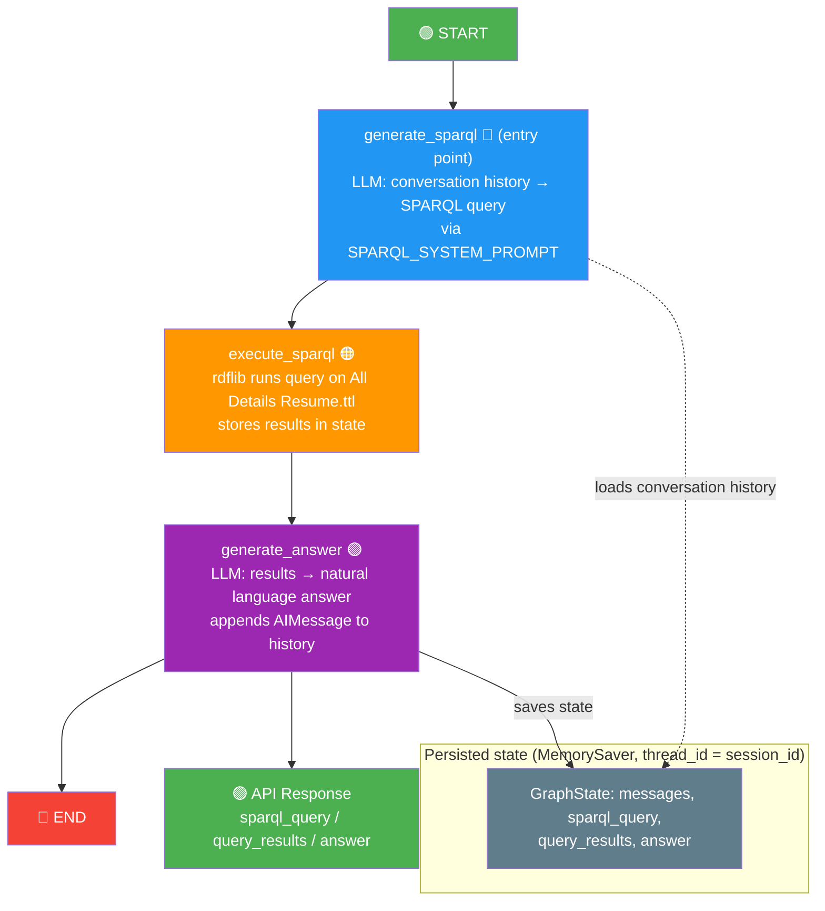

# Django RDF Semantic Resume Agent 🧠🕸️

A lightweight, production-grade Django service that combines **RDF/Turtle (.ttl)** data modeling, local **SPARQL** querying via `rdflib`, and advanced LLM reasoning through **OpenRouter** (powered by NVIDIA Nemotron 3 Ultra).

Instead of dumping raw documents or bloated text chunks into an LLM context window, this project implements a precise **GraphRAG-lite** pattern: translating natural language questions into deterministic SPARQL graph queries to eliminate hallucinations and extract exact background data.

---

## 🚀 Architecture & Workflow

1. **Semantic Ingestion:** Candidate details and skill networks are structured into standard ontologies (such as Schema.org's `schema:Person`) and serialized as compact **RDF Turtle (`.ttl`)**.
2. **Intent Translation:** The user types a natural language prompt into the Django interface. The LLM translates this prompt into a precise **SPARQL SELECT query**.
3. **Local Execution:** Python's `rdflib` runs the SPARQL query locally against the in-memory `.ttl` graph, ensuring 100% data grounding and factual alignment.
4. **Natural Language Synthesis:** The precise query results are passed back to the LLM to synthesize a professional, context-aware answer for the user.

---

## 🛠️ Tech Stack

* **Backend:** Python, Django 5.2 (LTS)
* **Semantic Graph Engine:** `rdflib` 7.1 (RDF parsing and SPARQL 1.1 engine)
* **LLM Orchestration:** OpenAI-compatible API via OpenRouter (`requests` library)
* **AI Model:** NVIDIA Nemotron-3-Ultra-550B via OpenRouter (`nvidia/nemotron-3-ultra-550b-a55b:free`)
* **API Documentation:** Swagger / OpenAPI via `drf-yasg`
* **Environment Management:** `python-dotenv`

---

## 📁 Project Structure

```
personal-knowledge-graph/
├── manage.py
├── requirements.txt
├── .env                        # OpenRouter API config (git-ignored)
├── .env.example                # Template for .env
├── .gitignore
├── All Details Resume.md      # Source resume markdown file
├── All Details Resume.ttl     # Generated RDF knowledge graph
├── config/                    # Django project configuration
│   ├── settings.py            # Settings (loads .env, registers apps)
│   ├── urls.py                # Root URL routing + Swagger
│   ├── asgi.py
│   └── wsgi.py
├── core/                      # Core app (home page)
│   ├── views.py
│   └── urls.py
└── resume_api/                # Resume API app
    ├── views.py               # API endpoints + system prompts
    ├── urls.py                # API URL routing
    ├── serializers.py         # DRF serializers for Swagger
    ├── tests.py               # 38 unit tests
    └── services/
        ├── rdf_converter.py   # Resume markdown → RDF converter
        ├── openrouter_service.py  # OpenRouter LLM client
        └── sparql_service.py  # SPARQL query execution engine
```

---

## 🔧 Installation

### Prerequisites

* Python 3.10+
* pip

### Steps

1. **Clone the repository:**
   ```bash
   git clone <your-repo-url>
   cd personal-knowledge-graph
   ```

2. **Install dependencies:**
   ```bash
   pip install -r requirements.txt
   ```

3. **Configure environment variables:**
   ```bash
   cp .env.example .env
   ```
   Edit `.env` and replace `your-openrouter-api-key-here` with your actual OpenRouter API key:
   ```env
   OPENROUTER_BASE_URL=https://openrouter.ai/api/v1
   OPENROUTER_API_KEY=sk-or-v1-xxxxxxxxxxxxxxxxxxxxxxxx
   ```

4. **Run database migrations:**
   ```bash
   python3 manage.py migrate
   ```

---

## ▶️ Execution

### Start the development server

```bash
python3 manage.py runserver
```

The server will start at `http://127.0.0.1:8000/`.

### Generate the RDF knowledge graph

```bash
curl -X POST http://127.0.0.1:8000/api/convert-resume/
```

This reads `All Details Resume.md`, converts it to RDF, and writes `All Details Resume.ttl` in the same directory.

### Search the knowledge graph

```bash
curl -X POST http://127.0.0.1:8000/api/search-knowledge-graph/ \
  -H "Content-Type: application/json" \
  -d '{"prompt": "What companies has the candidate worked at?"}'
```

**Example response:**
```json
{
  "prompt": "What companies has the candidate worked at?",
  "model": "nvidia/nemotron-3-ultra-550b-a55b:free",
  "sparql_query": "PREFIX resume: <http://example.org/resume#> SELECT ?company WHERE { ... }",
  "query_results": {
    "columns": ["company"],
    "rows": [
      {"company": "DeepSkill GmbH"},
      {"company": "Greator GmbH"},
      {"company": "Mindshine GmbH"},
      {"company": "VentureDive"},
      {"company": "Centegy Technologies"},
      {"company": "Digital Dividend"}
    ],
    "row_count": 6
  },
  "answer": "The candidate has worked at 6 companies: DeepSkill GmbH, Greator GmbH, Mindshine GmbH, VentureDive, Centegy Technologies, and Digital Dividend."
}
```

---

## 📡 API Endpoints

| Method | Endpoint | Description |
|--------|----------|-------------|
| `POST` | `/api/convert-resume/` | Convert resume markdown to RDF (.ttl) |
| `POST` | `/api/search-knowledge-graph/` | Search knowledge graph with AI (natural language → SPARQL → results → natural language) |
| `GET` | `/swagger/` | Swagger UI (interactive API documentation) |
| `GET` | `/redoc/` | ReDoc UI (alternative API documentation) |
| `GET` | `/swagger.json` | Swagger JSON schema |
| `GET` | `/swagger.yaml` | Swagger YAML schema |
| `GET` | `/` | Home page |

---

## 🔍 How the Knowledge Graph Search Works


---

## 🔄 LangGraph Workflow (Conversational Search)

The `/api/search-knowledge-graph/` endpoint is orchestrated by a **LangGraph StateGraph** built in `resume_api/services/langgraph_service.py`. Unlike a single-shot pipeline, this workflow maintains conversation context across turns using a `MemorySaver` checkpointer keyed by `thread_id` (the client-provided `session_id`).

The line `workflow.set_entry_point("generate_sparql")` declares **where execution starts**: the **`generate_sparql`** node. Edges alone only describe transitions between nodes; this line anchors the graph so that `_compiled_workflow.invoke(...)` always begins at the SPARQL-generation step.



This means every user turn always flows through the same pipeline: **translate conversation to SPARQL → execute locally on the RDF graph → synthesize a natural-language answer** — while the dashed lines show how prior turns are loaded from and saved back to the checkpointer, enabling follow-ups like *"What did she do there?"* to resolve correctly against earlier context.

---

## 🧪 Testing

Run the full test suite (38 tests):

```bash
python3 manage.py test resume_api -v 2
```

**Test coverage:**

| Test Class | Tests | Description |
|------------|-------|-------------|
| `RDFConverterServiceTests` | 11 | RDF converter parsing functions |
| `ResumeApiEndpointTests` | 6 | Convert-resume endpoint |
| `OpenRouterServiceTests` | 4 | OpenRouter API client |
| `SparqlServiceTests` | 6 | SPARQL execution engine |
| `SearchKnowledgeGraphEndpointTests` | 7 | Search endpoint (success, errors, method validation) |
| `SwaggerEndpointTests` | 4 | Swagger/ReDoc documentation |

---

## 📊 RDF Knowledge Graph Ontology

The knowledge graph uses the following namespaces:

| Prefix | URI |
|--------|-----|
| `foaf` | `http://xmlns.com/foaf/0.1/` |
| `schema` | `https://schema.org/` |
| `resume` | `http://example.org/resume#` |
| `rdf` | `http://www.w3.org/1999/02/22-rdf-syntax-ns#` |

**Entity types:**

| Type | Properties |
|------|------------|
| `foaf:Person` | `foaf:name`, `schema:jobTitle` |
| `resume:ProfessionalExperience` | `resume:company`, `resume:location`, `resume:dates`, `resume:role`, `resume:hasBulletPoint` |
| `resume:BulletPoint` | `rdf:value` |
| `resume:Education` | `resume:institution`, `resume:dates`, `schema:educationalCredentialAwarded` |
| `resume:Language` | `resume:language`, `resume:proficiency` |
| `resume:AcademicExperience` | `schema:name`, `resume:year`, `resume:location`, `resume:challenge`, `resume:technologyStack`, `resume:outcome`, `schema:url` |
| `resume:SkillCategory` | `resume:skillCategory`, `resume:hasSkill` |
| `resume:Skill` | `rdf:value` |
| `resume:SkillDetail` | `schema:name`, `resume:hasSkillItem` |
| `resume:SkillItem` | `rdf:value` |
| `resume:Project` | `schema:name` |

---

## 📦 Dependencies

| Package | Version | Purpose |
|---------|---------|---------|
| Django | 5.2.16 | Web framework |
| rdflib | 7.1.1 | RDF parsing & SPARQL engine |
| djangorestframework | 3.17.1 | REST API framework |
| drf-yasg | 1.21.15 | Swagger/OpenAPI documentation |
| python-dotenv | 1.0.1 | Environment variable loading |
| requests | 2.31.0 | HTTP client for OpenRouter API |

---

## 🔐 Environment Variables

| Variable | Description | Default |
|----------|-------------|---------|
| `OPENROUTER_BASE_URL` | OpenRouter API base URL | `https://openrouter.ai/api/v1` |
| `OPENROUTER_API_KEY` | Your OpenRouter API key | (required) |

---

## 📄 License

This project is licensed under the BSD License.