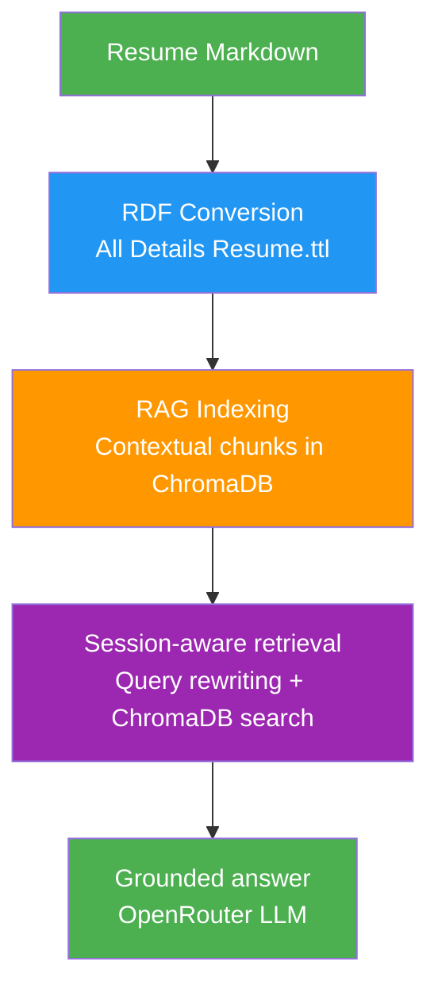
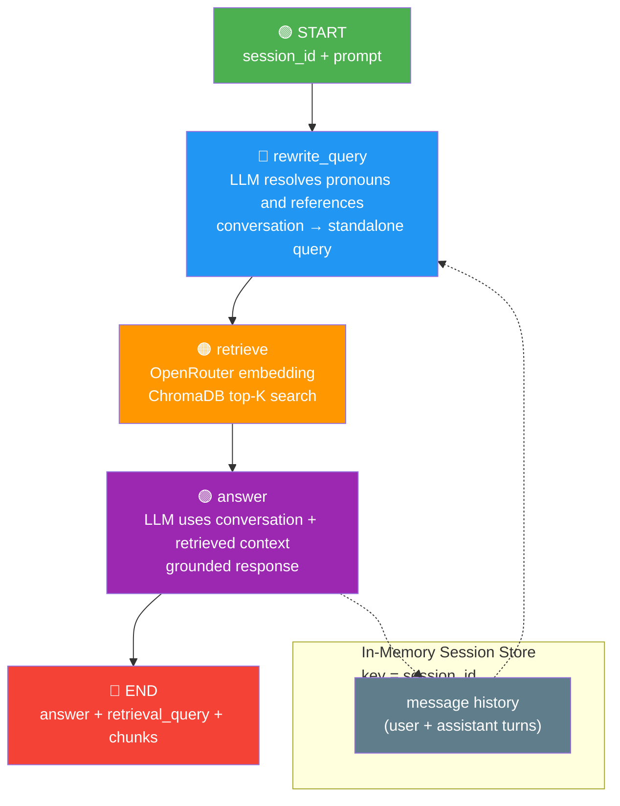

# Django RDF Semantic Resume Agent 🧠🕸️

A lightweight Django service that combines **RDF/Turtle (.ttl)** data modeling and session-aware **RAG** through **ChromaDB** and **OpenRouter**.

Instead of dumping raw documents or bloated text chunks into an LLM context window, this project uses the RDF graph as a precise source of structured resume data and provides a session-aware vector RAG API for grounded answers.

---

## 🚀 Architecture & Workflow

1. **Semantic Ingestion:** Candidate details and skill networks are structured into standard ontologies (such as Schema.org's `schema:Person`) and serialized as compact **RDF Turtle (`.ttl`)**.
2. **RAG Indexing:** Resume entities are converted into contextual chunks and indexed in a persistent ChromaDB collection.
3. **Conversational Retrieval:** The session-aware RAG workflow rewrites follow-up questions into standalone retrieval queries and retrieves relevant resume chunks.
4. **Natural Language Synthesis:** The retrieved context is passed to the LLM to synthesize a professional, grounded answer for the user.

The project also provides a vector RAG path. Resume entities are indexed as contextual chunks in ChromaDB. A simple in-memory session store retains conversation history, rewrites follow-up questions into standalone retrieval queries, retrieves the most relevant chunks, and generates an answer grounded only in those chunks.

---

## 🛠️ Tech Stack

* **Backend:** Python, Django 5.2 (LTS)
* **Semantic Graph Engine:** `rdflib` 7.1 (RDF parsing and SPARQL 1.1 engine)
* **LLM Orchestration:** OpenAI-compatible API via OpenRouter (`requests` library)
* **AI Model:** Inclusion AI Ling 3.0 Flash via OpenRouter (`inclusionai/ling-3.0-flash`) — configured centrally in `resume_api/services/model_config.py`
* **Vector Retrieval:** ChromaDB persistent collection with OpenRouter embeddings
* **RAG Orchestration:** Simple sequential workflow (no LangGraph dependency)
* **API Documentation:** Swagger / OpenAPI via `drf-yasg`
* **Environment Management:** `python-dotenv`

---

## 📁 Project Structure

```
personal-knowledge-graph/
├── manage.py
├── requirements.txt
├── .env                        # OpenRouter API config (git-ignored)
├── .env.example                # Template for .env
├── .gitignore
├── All Details Resume.md      # Source resume markdown file
├── All Details Resume.ttl     # Generated RDF knowledge graph
├── config/                    # Django project configuration
│   ├── settings.py            # Settings (loads .env, registers apps)
│   ├── urls.py                # Root URL routing + Swagger
│   ├── asgi.py
│   └── wsgi.py
├── core/                      # Core app (home page)
│   ├── views.py
│   └── urls.py
└── resume_api/                # Resume API app
    ├── views.py               # API endpoints (direct service calls, no DI container)
    ├── urls.py                # API URL routing
    ├── serializers.py         # DRF serializers for Swagger
    ├── utils.py               # Shared utilities (embedding client)
    ├── tests.py               # 33 unit tests
    └── services/
        ├── rdf_converter.py   # Resume markdown → RDF converter
        ├── openrouter_service.py  # OpenRouter LLM client (with logging)
        ├── rag_service.py     # Session-aware RAG workflow (no LangGraph)
        ├── rag_indexer.py     # RDF entities → contextual vector chunks
        ├── vector_repository.py  # ChromaDB semantic retrieval
        └── model_config.py    # Central model configuration (single source of truth)
```

---

## 🔧 Installation

### Prerequisites

* Python 3.10+
* pip

### Steps

1. **Clone the repository:**
   ```bash
   git clone <your-repo-url>
   cd personal-knowledge-graph
   ```

2. **Install dependencies:**
   ```bash
   pip install -r requirements.txt
   ```

3. **Configure environment variables:**
   ```bash
   cp .env.example .env
   ```
   Edit `.env` and replace `your-openrouter-api-key-here` with your actual OpenRouter API key:
   ```env
   OPENROUTER_BASE_URL=https://openrouter.ai/api/v1
   OPENROUTER_API_KEY=sk-or-v1-xxxxxxxxxxxxxxxxxxxxxxxx
   ```

4. **Run database migrations:**
   ```bash
   python3 manage.py migrate
   ```

5. **Build the RAG index:**
   ```bash
   python3 manage.py reindex_rag
   ```

   Re-run this command whenever `All Details Resume.ttl` or the chunking logic changes. Bullet-point chunks include their parent company, role, dates, and location so related responsibilities can be retrieved reliably.

---

## ▶️ Execution

### Start the development server

```bash
python3 manage.py runserver
```

The server will start at `http://127.0.0.1:8000/`.

### Generate the RDF knowledge graph

```bash
curl -X POST http://127.0.0.1:8000/api/convert-resume/
```

This reads `All Details Resume.md`, converts it to RDF, and writes `All Details Resume.ttl` in the same directory.

### Session-aware semantic RAG search

Use `/api/search-rag/` for vector retrieval and conversational follow-ups:

```bash
curl -X POST http://127.0.0.1:8000/api/search-rag/ \
  -H "Content-Type: application/json" \
  -d '{"prompt": "When did Dooa work at Greator?"}'
```

The first response contains a generated `session_id` and the `retrieval_query`. Reuse the session ID for follow-up questions:

```bash
curl -X POST http://127.0.0.1:8000/api/search-rag/ \
  -H "Content-Type: application/json" \
  -d '{"prompt": "What did she do there?", "session_id": "<session-id-from-response>"}'
```

The request body accepts only `prompt` and optional `session_id`. Retrieval size is controlled server-side by `RAG_TOP_K`.

---

## 📡 API Endpoints

| Method | Endpoint | Description |
|--------|----------|-------------|
| `POST` | `/api/convert-resume/` | Convert resume markdown to RDF (.ttl) |
| `POST` | `/api/search-rag/` | Session-aware vector RAG with query rewriting |
| `GET` | `/swagger/` | Swagger UI (interactive API documentation) |
| `GET` | `/redoc/` | ReDoc UI (alternative API documentation) |
| `GET` | `/swagger.json` | Swagger JSON schema |
| `GET` | `/swagger.yaml` | Swagger YAML schema |
| `GET` | `/` | Home page |

---

## 🔍 RDF Knowledge Graph and RAG



---

## RAG Workflow (Session-aware)

The `/api/search-rag/` endpoint uses a simple sequential workflow in `resume_api/services/rag_service.py`:



The rewrite node is an LLM call, but it uses the existing configured model. It is intentionally separate from retrieval: conversation history is retained for context resolution, while ChromaDB receives one focused standalone query instead of a concatenation of previous topics. Session state is stored in memory (replace with Django cache or database for production).

---

## 🧪 Testing

Run the full test suite (33 tests):

```bash
python3 manage.py test resume_api -v 2
```

**Test coverage:**

| Test Class | Tests | Description |
|------------|-------|-------------|
| `RDFConverterServiceTests` | 11 | RDF converter parsing functions |
| `ResumeApiEndpointTests` | 6 | Convert-resume endpoint |
| `RagSearchEndpointTests` | 4 | Session-aware RAG API validation |
| `RagServiceTests` | 2 | Query rewriting, retrieval, and session history |
| `OpenRouterServiceTests` | 4 | OpenRouter API client |
| `SwaggerEndpointTests` | 4 | Swagger/ReDoc documentation |

---

## 📊 RDF Knowledge Graph Ontology

The knowledge graph uses the following namespaces:

| Prefix | URI |
|--------|-----|
| `foaf` | `http://xmlns.com/foaf/0.1/` |
| `schema` | `https://schema.org/` |
| `resume` | `http://example.org/resume#` |
| `rdf` | `http://www.w3.org/1999/02/22-rdf-syntax-ns#` |

**Entity types:**

| Type | Properties |
|------|------------|
| `foaf:Person` | `foaf:name`, `schema:jobTitle` |
| `resume:ProfessionalExperience` | `resume:company`, `resume:location`, `resume:dates`, `resume:role`, `resume:hasBulletPoint` |
| `resume:BulletPoint` | `rdf:value` |
| `resume:Education` | `resume:institution`, `resume:dates`, `schema:educationalCredentialAwarded` |
| `resume:Language` | `resume:language`, `resume:proficiency` |
| `resume:AcademicExperience` | `schema:name`, `resume:year`, `resume:location`, `resume:challenge`, `resume:technologyStack`, `resume:outcome`, `schema:url` |
| `resume:SkillCategory` | `resume:skillCategory`, `resume:hasSkill` |
| `resume:Skill` | `rdf:value` |
| `resume:SkillDetail` | `schema:name`, `resume:hasSkillItem` |
| `resume:SkillItem` | `rdf:value` |
| `resume:Project` | `schema:name` |

---

## 📦 Dependencies

| Package | Version | Purpose |
|---------|---------|---------|
| Django | 5.2.16 | Web framework |
| rdflib | 7.1.1 | RDF parsing & SPARQL engine |
| djangorestframework | 3.17.1 | REST API framework |
| drf-yasg | 1.21.15 | Swagger/OpenAPI documentation |
| python-dotenv | 1.0.1 | Environment variable loading |
| `requests` | 2.31.0 | HTTP client for OpenRouter API |
| `chromadb` | 0.6.3+ | Persistent vector database |
| `openai` | 2.x | OpenRouter-compatible embeddings client |

---

## 🔐 Environment Variables

| Variable | Description | Default |
|----------|-------------|---------|
| `OPENROUTER_BASE_URL` | OpenRouter API base URL | `https://openrouter.ai/api/v1` |
| `OPENROUTER_API_KEY` | Your OpenRouter API key | (required) |
| `EMBEDDING_MODEL` | OpenRouter-compatible embedding model | `openai/text-embedding-3-small` |
| `CHROMA_PERSIST_PATH` | Persistent ChromaDB storage path | `./data/chroma` |
| `RAG_COLLECTION_NAME` | ChromaDB collection name | `resume_chunks` |
| `RAG_TOP_K` | Number of chunks passed to the RAG answer model | `2` |

---

## 📄 License

This project is licensed under the BSD License.