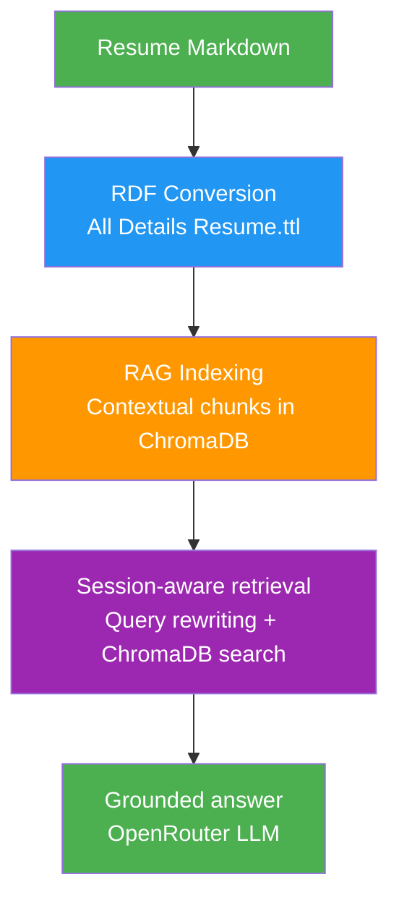
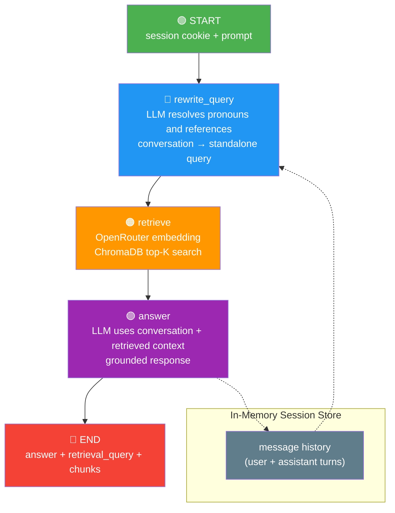

# Resume RDF Semantic Agent 🧠🕸️

A lightweight FastAPI service that combines **RDF/Turtle (.ttl)** data modeling and session-aware **RAG** through **ChromaDB** and **OpenRouter**.

Instead of dumping raw documents or bloated text chunks into an LLM context window, this project uses the RDF graph as a precise source of structured resume data and provides a session-aware vector RAG API for grounded answers.

---

## 🚀 Architecture & Workflow

1. **Semantic Ingestion:** Candidate details and skill networks are structured into standard ontologies (such as Schema.org's `schema:Person`) and serialized as compact **RDF Turtle (`.ttl`)**.
2. **RAG Indexing:** Resume entities are converted into contextual chunks and indexed in a persistent ChromaDB collection.
3. **Conversational Retrieval:** The session-aware RAG workflow rewrites follow-up questions into standalone retrieval queries and retrieves relevant resume chunks.
4. **Natural Language Synthesis:** The retrieved context is passed to the LLM to synthesize a professional, grounded answer.

---

## 🛠️ Tech Stack

- **Backend:** Python, FastAPI
- **Semantic Graph Engine:** `rdflib` 7.1 (RDF parsing and SPARQL 1.1 engine)
- **LLM Orchestration:** OpenAI-compatible API via OpenRouter (`requests` library)
- **AI Model:** Inclusion AI Ling 3.0 Flash via OpenRouter (`inclusionai/ling-3.0-flash`) — configurable via `DEFAULT_MODEL` in `src/config.py` / `.env`
- **Vector Retrieval:** ChromaDB persistent collection with OpenRouter embeddings
- **RAG Orchestration:** Simple sequential workflow (no LangGraph dependency)
- **API Documentation:** Auto-generated OpenAPI via FastAPI + Pydantic
- **Environment Management:** `python-dotenv`
- **Session Management:** Cookie-based anonymous sessions (HttpOnly, SameSite=Strict) via Starlette middleware
- **Package Manager:** uv

---

## ⚡ Why FastAPI?

FastAPI was chosen as the backend framework for this service due to several architectural advantages:

- **High-Performance & Async Support:** Built on Starlette and ASGI, FastAPI efficiently handles concurrent, I/O-bound operations (such as ChromaDB vector queries and external OpenRouter LLM API calls) with minimal latency.
- **Automatic Validation & Type Safety:** Seamless integration with Pydantic ensures strict schema validation, type safety, and automatic serialization for search requests, prompts, and RAG chunk responses.
- **Built-in OpenAPI Documentation:** Generates interactive Swagger UI (`/docs`) and ReDoc (`/redoc`) specifications out of the box with zero additional configuration.
- **Clean Dependency Injection (`Depends`):** Enables modular and testable security/session handling (such as cookie-based session verification via `get_session_id`).
- **Modern Python Standards:** Leverages standard Python 3.10+ type hints for clean, readable, and maintainable code.

---

## 📁 Project Structure

```
personal-knowledge-graph/
├── pyproject.toml              # Project metadata & dependencies (uv)
├── uv.lock                     # Locked dependency versions
├── .env                        # OpenRouter API config (git-ignored)
├── .env.example                # Template for .env
├── .gitignore
├── All Details Resume.md       # Source resume markdown file
├── All Details Resume.ttl      # Generated RDF knowledge graph
├── chroma/                     # ChromaDB persistent storage (or data/chroma/)
├── scripts/
│   └── reindex_embeddings.py   # CLI to rebuild the ChromaDB RAG index
├── src/
│   ├── main.py                 # FastAPI app factory
│   ├── config.py               # Central configuration (env vars)
│   ├── utils.py                # ChromaDB & OpenAI client factories & helpers
│   ├── middlewares.py          # Session middleware + session validation helper
│   ├── routers/
│   │   ├── parse_resume.py     # POST /api/convert-resume
│   │   └── ai_chat.py          # POST /api/search-rag
│   ├── schemas/
│   │   ├── convert.py          # ConvertResponse, ErrorResponse
│   │   └── rag.py              # RagSearchRequest/Response, RagChunk
│   └── services/
│       ├── openrouter_service.py  # OpenRouter LLM client
│       ├── ai_chat_rag_service.py # Session-aware RAG workflow
│       ├── rag_indexer.py      # RDF entities → vector chunks
│       └── resume_md_to_rdf.py # Resume markdown → RDF converter
└── tests/
    ├── conftest.py             # Test fixtures
    ├── test_parse_resume.py    # Parse resume endpoint tests
    └── test_ai_chat.py         # AI chat RAG endpoint tests
```

---

## 🔧 Installation

### Prerequisites

- Python 3.10+
- [uv](https://docs.astral.sh/uv/)

### Steps

1. **Clone the repository:**
   ```bash
   git clone <your-repo-url>
   cd personal-knowledge-graph
   ```

2. **Install dependencies:**
   ```bash
   uv sync
   ```

3. **Configure environment variables:**
   ```bash
   cp .env.example .env
   ```
   Edit `.env` and replace `your-openrouter-api-key-here` with your actual OpenRouter API key:
   ```env
   OPENROUTER_BASE_URL=https://openrouter.ai/api/v1
   OPENROUTER_API_KEY=sk-or-v1-xxxxxxxxxxxxxxxxxxxxxxxx
   ```

4. **Build the RAG index:**
   ```bash
   uv run python -m scripts.reindex_embeddings
   ```

   Re-run this command whenever `All Details Resume.ttl` or the chunking logic changes.

---

## ▶️ Execution

### Start the development server

```bash
uv run uvicorn src.main:app --reload
```

The server starts at `http://127.0.0.1:8000/`. Interactive API docs at `http://127.0.0.1:8000/docs`.

### Generate the RDF knowledge graph

```bash
curl -X POST http://127.0.0.1:8000/api/convert-resume
```

This reads `All Details Resume.md`, converts it to RDF, and writes `All Details Resume.ttl` in the same directory.

### Session-aware semantic RAG search

Sessions are cookie-based (HttpOnly, SameSite=Strict) — the browser automatically manages the session cookie:

```bash
# Start a new conversation (session cookie auto-created)
curl -X POST http://127.0.0.1:8000/api/search-rag \
  -H "Content-Type: application/json" \
  -c cookies.txt \
  -d '{"prompt": "When did Dooa work at Greator?"}'
```

Reuse the session cookie for follow-up questions:

```bash
# Follow-up (uses the same session cookie)
curl -X POST http://127.0.0.1:8000/api/search-rag \
  -H "Content-Type: application/json" \
  -b cookies.txt \
  -d '{"prompt": "What did she do there?"}'
```

---

## 📡 API Endpoints

| Method | Endpoint | Description |
|--------|----------|-------------|
| `POST` | `/api/convert-resume` | Convert resume markdown to RDF (.ttl) — requires session cookie |
| `POST` | `/api/search-rag` | Session-aware vector RAG with query rewriting — requires session cookie |
| `GET` | `/docs` | Swagger UI (interactive API documentation) |
| `GET` | `/openapi.json` | OpenAPI JSON schema |

---

## 🔐 Session & Security

### Anonymous Session Enforcement

Every API request requires a valid anonymous session. The `SessionEnforcerMiddleware` automatically creates a browser-session cookie on the first visit. The `get_session_id` dependency rejects requests without a valid session with HTTP 403.

**Session cookie properties:**
- **HttpOnly** — inaccessible to JavaScript (prevents XSS cookie theft)
- **SameSite=Strict** — only sent for same-site requests (blocks CSRF)
- **Expires on browser close** — one-time session enforcement

---

## 🔍 RDF Knowledge Graph and RAG



---

## RAG Workflow (Session-aware)

The `/api/search-rag` endpoint uses a simple sequential workflow in `src/services/ai_chat_rag_service.py`:



---

## 🧪 Testing

```bash
uv run pytest -v
```

---

## 📊 RDF Knowledge Graph Ontology

| Prefix | URI |
|--------|-----|
| `foaf` | `http://xmlns.com/foaf/0.1/` |
| `schema` | `https://schema.org/` |
| `resume` | `http://example.org/resume#` |
| `rdf` | `http://www.w3.org/1999/02/22-rdf-syntax-ns#` |

**Entity types:**

| Type | Properties |
|------|------------|
| `foaf:Person` | `foaf:name`, `schema:jobTitle` |
| `resume:ProfessionalExperience` | `resume:company`, `resume:location`, `resume:dates`, `resume:role`, `resume:hasBulletPoint` |
| `resume:BulletPoint` | `rdf:value` |
| `resume:Education` | `resume:institution`, `resume:dates`, `schema:educationalCredentialAwarded` |
| `resume:Language` | `resume:language`, `resume:proficiency` |
| `resume:AcademicExperience` | `schema:name`, `resume:year`, `resume:location`, `resume:challenge`, `resume:technologyStack`, `resume:outcome`, `schema:url` |
| `resume:SkillCategory` | `resume:skillCategory`, `resume:hasSkill` |
| `resume:Skill` | `rdf:value` |
| `resume:SkillDetail` | `schema:name`, `resume:hasSkillItem` |
| `resume:SkillItem` | `rdf:value` |
| `resume:Project` | `schema:name` |

---

## 📦 Dependencies

| Package | Purpose |
|---------|---------|
| FastAPI | Web framework |
| Pydantic | Request/response validation & OpenAPI schemas |
| Uvicorn | ASGI server |
| rdflib | RDF parsing & SPARQL engine |
| chromadb | Persistent vector database |
| openai | OpenRouter-compatible embeddings client |
| python-dotenv | Environment variable loading |
| httpx | HTTP client (testing) |

---

## 🔐 Environment Variables

| Variable | Description | Default |
|----------|-------------|---------|
| `OPENROUTER_BASE_URL` | OpenRouter API base URL | `https://openrouter.ai/api/v1` |
| `OPENROUTER_API_KEY` | Your OpenRouter API key | (required) |
| `DEFAULT_MODEL` | OpenRouter LLM model for RAG & query rewriting | `inclusionai/ling-3.0-flash` |
| `EMBEDDING_MODEL` | OpenRouter-compatible embedding model | `openai/text-embedding-3-small` |
| `CHROMA_PERSIST_PATH` | Persistent ChromaDB storage path | `./chroma` |
| `RAG_COLLECTION_NAME` | ChromaDB collection name | `resume_chunks` |
| `RAG_TOP_K` | Number of chunks passed to the RAG answer model | `2` |

---

## 📄 License

This project is licensed under the BSD License.